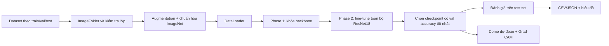

# Livestock Diseases AI


Hệ thống phân loại bệnh vật nuôi từ ảnh, được xây dựng bằng PyTorch và mô hình ResNet18. Project hiện gồm ba bài toán độc lập dành cho **bò**, **gà** và **lợn**. Mỗi bài toán có notebook huấn luyện, checkpoint riêng, báo cáo đánh giá và biểu đồ trực quan.

> Đây là mô hình hỗ trợ sàng lọc từ hình ảnh phục vụ học tập và nghiên cứu. Kết quả dự đoán không thay thế chẩn đoán của bác sĩ thú y.

## 1. Tổng quan hiện tại

| Hạng mục | Trạng thái |
|---|---|
| Bài toán | Phân loại ảnh đa lớp (multi-class image classification) |
| Đối tượng | Bò, gà và lợn |
| Số mô hình | 3 mô hình ResNet18 độc lập |
| Tổng số lớp | 18 lớp: bò 4, gà 4, lợn 10 |
| Tổng số ảnh đã sử dụng | 18.260 ảnh |
| Huấn luyện | Transfer learning gồm 2 phase |
| Đánh giá | Accuracy, macro F1, weighted F1, confusion matrix, F1 từng lớp |
| Giải thích dự đoán | Grad-CAM |
| Giao diện | Notebook demo; frontend web đang ở mức prototype |

Ba mô hình được tách riêng vì ảnh và nhóm bệnh của từng loài có đặc trưng khác nhau:

| Mô hình | Dữ liệu | Số lớp | Train | Validation | Test | Tổng |
|---|---|---:|---:|---:|---:|---:|
| Cow | Ảnh bệnh ở bò | 4 | 2.233 | 477 | 484 | 3.194 |
| Chicken | Ảnh phân gà | 4 | 5.644 | 1.206 | 1.217 | 8.067 |
| Pig | Ảnh bệnh da ở lợn | 10 | 4.892 | 1.047 | 1.060 | 6.999 |

## 2. Luồng xử lý của hệ thống



Quy trình huấn luyện của mỗi loài:

1. Đọc dữ liệu từ ba tập `train`, `val`, `test` bằng `ImageFolder`.
2. Kiểm tra các thư mục split tồn tại và thứ tự lớp giống nhau.
3. Tính class weight từ tập train để giảm ảnh hưởng của mất cân bằng lớp.
4. Áp dụng augmentation cho tập train; validation và test chỉ resize, chuẩn hóa.
5. Huấn luyện Phase 1 bằng cách khóa backbone và chỉ học classification head.
6. Nạp checkpoint Phase 1 tốt nhất, mở khóa toàn bộ backbone và fine-tune ở Phase 2.
7. Nạp checkpoint tốt nhất của từng phase trước khi đánh giá trên test set.
8. Lưu model, lịch sử train, báo cáo phân loại và các biểu đồ.

## 3. Kiến trúc và cấu hình huấn luyện

| Thành phần | Cấu hình |
|---|---|
| Backbone | ResNet18 pretrained trên ImageNet |
| Kích thước đầu vào | 224 × 224 RGB |
| Classification head | Dropout 0,3 + Linear theo số lớp |
| Loss | Cross-entropy có class weight |
| Optimizer | AdamW, weight decay `1e-4` |
| Scheduler | CosineAnnealingLR, `eta_min=1e-6` |
| Phase 1 | 10 epoch, learning rate `1e-3`, khóa backbone |
| Phase 2 | 15 epoch, learning rate `1e-4`, fine-tune toàn bộ model |
| Batch size | 32 |
| Seed | 42 |
| Tiêu chí lưu model | Validation accuracy tốt nhất |

Augmentation của tập train gồm `RandomResizedCrop`, lật ngang, xoay tối đa 15 độ và `ColorJitter`. Tất cả ảnh được chuẩn hóa theo mean/std của ImageNet.

## 4. Kết quả thực nghiệm

Các số liệu dưới đây được lấy trực tiếp từ báo cáo hiện có trong thư mục `results/`.

| Đối tượng | Phase | Test accuracy | Macro F1 | Weighted F1 |
|---|---|---:|---:|---:|
| Cow | Phase 1 | 79,34% | 78,81% | 79,45% |
| Cow | **Phase 2** | **90,91%** | **90,64%** | **90,92%** |
| Chicken | Phase 1 | 90,22% | 85,36% | 90,08% |
| Chicken | **Phase 2** | **98,11%** | **98,24%** | **98,11%** |
| Pig | Phase 1 | 59,72% | 59,14% | 59,16% |
| Pig | **Phase 2** | **81,32%** | **81,21%** | **81,22%** |

Phase 2 tốt hơn rõ rệt ở cả ba nhóm, cho thấy fine-tuning toàn bộ backbone phù hợp hơn so với chỉ huấn luyện classification head. Kết quả của lợn thấp hơn hai nhóm còn lại do có nhiều lớp hơn và các bệnh da có biểu hiện thị giác gần nhau.

### Biểu đồ Phase 2

| Đối tượng | Training curves | Confusion matrix | F1 từng lớp |
|---|---|---|---|
| Cow | [Xem biểu đồ](figures/cow_training2_curves_phase2.png) | [Xem ma trận](figures/cow_confusion_matrix_phase2.png) | [Xem F1](figures/cow_per_class_f1_phase2.png) |
| Chicken | [Xem biểu đồ](figures/chicken_training_curves_phase2.png) | [Xem ma trận](figures/chicken_confusion_matrix_phase2.png) | [Xem F1](figures/chicken_per_class_f1_phase2.png) |
| Pig | [Xem biểu đồ](figures/pig_training_curves_phase2.png) | [Xem ma trận](figures/pig_confusion_matrix_phase2.png) | [Xem F1](figures/pig_per_class_f1_phase2.png) |

## 5. Cấu trúc project

```text
livestock-diseases-ai/
├── data/                         # Dataset local, không đưa lên Git
│   ├── Cow_data/                 # Dữ liệu bò
│   └── Livestock_Dataset/
│       ├── Poultry_Feces/        # Dữ liệu gà
│       └── Livestock_Skin/       # Dữ liệu lợn
├── figures/                      # Confusion matrix, F1 và training curves
├── frontend/                     # Giao diện web prototype
├── models/                       # Checkpoint tốt nhất của từng phase
├── notebooks/
│   ├── 01_cow_pipeline.ipynb     # Train và đánh giá mô hình bò
│   ├── 01_chicken_pipeline.ipynb # Train và đánh giá mô hình gà
│   ├── 01_pig_pipeline.ipynb     # Train và đánh giá mô hình lợn
│   ├── 02_demo.ipynb             # Demo inference chính
│   └── 03_demoRad.ipynb          # Notebook thử nghiệm cũ, không thuộc luồng chính
├── results/                      # History và classification report
├── src/
│   ├── dataset.py                # Transform, đọc dataset, class weight, DataLoader
│   ├── evaluate.py               # Metric và biểu đồ đánh giá
│   ├── gradcam.py                # Inference và Grad-CAM
│   ├── load_model.py             # Khởi tạo model và nạp checkpoint
│   ├── model.py                  # Kiến trúc ResNet18, freeze/unfreeze, checkpoint
│   ├── train.py                  # Vòng lặp train/validation hai phase
│   └── utils.py                  # Seed, JSON và tên hiển thị
├── requirements.txt
└── README.md
```

## 6. Chuẩn bị môi trường

Yêu cầu khuyến nghị:

- Python 3.11 hoặc 3.12.
- GPU NVIDIA hỗ trợ CUDA để train nhanh hơn; vẫn có thể chạy CPU nhưng sẽ lâu.
- Máy đã chạy thực nghiệm hiện tại dùng GPU RTX 2050 4 GB với batch size 32.

Trên PowerShell:

```powershell
python -m venv venv
.\venv\Scripts\Activate.ps1
python -m pip install --upgrade pip
pip install -r requirements.txt
```

Kiểm tra PyTorch và GPU:

```powershell
python -c "import torch; print(torch.__version__); print(torch.cuda.is_available())"
```

Nếu CUDA hoạt động, dòng cuối trả về `True`. Ở lần chạy đầu, torchvision có thể cần tải pretrained weights của ResNet18.

## 7. Chuẩn bị dữ liệu

Dataset không được commit vì dung lượng lớn. Mỗi bộ dữ liệu phải có cấu trúc `ImageFolder` như sau:

```text
dataset_root/
├── train/
│   ├── Class_A/
│   ├── Class_B/
│   └── ...
├── val/
│   ├── Class_A/
│   ├── Class_B/
│   └── ...
└── test/
    ├── Class_A/
    ├── Class_B/
    └── ...
```

Đường dẫn mà các notebook đang sử dụng:

| Notebook | Dataset path |
|---|---|
| `01_cow_pipeline.ipynb` | `data/Cow_data/` |
| `01_chicken_pipeline.ipynb` | `data/Livestock_Dataset/Poultry_Feces/` |
| `01_pig_pipeline.ipynb` | `data/Livestock_Dataset/Livestock_Skin/` |

Tên thư mục lớp trong `train`, `val` và `test` phải giống nhau. `src/dataset.py` sẽ dừng và báo lỗi nếu thiếu split hoặc mapping lớp không đồng nhất.

## 8. Cách chạy project

### 8.1. Huấn luyện

Khởi động Jupyter:

```powershell
jupyter lab
```

Sau đó chọn kernel thuộc `venv` và chạy một trong ba notebook từ trên xuống dưới:

1. `notebooks/01_cow_pipeline.ipynb`
2. `notebooks/01_chicken_pipeline.ipynb`
3. `notebooks/01_pig_pipeline.ipynb`

Ba notebook độc lập, vì vậy không bắt buộc chạy theo thứ tự trên. Mỗi notebook thực hiện toàn bộ quy trình: đọc dữ liệu → smoke test → Phase 1 → đánh giá → Phase 2 → đánh giá.

Nếu GPU bị thiếu bộ nhớ, giảm `batch_size=32` xuống `16` hoặc `8` trong cell tạo DataLoader.

### 8.2. File đầu ra

Quy ước tên file sử dụng tiền tố `cow_`, `chicken_` hoặc `pig_`:

```text
models/resnet18_<animal>_phase1_best.pth
models/resnet18_<animal>_phase2_best.pth
results/history_<animal>_phase1.json
results/history_<animal>_phase2.json
results/<animal>_classification_report_phase1.{csv,json}
results/<animal>_classification_report_phase2.{csv,json}
figures/<animal>_confusion_matrix_phase*.png
figures/<animal>_per_class_f1_phase*.png
figures/<animal>_training_curves_phase*.png
```

### 8.3. Chạy demo dự đoán

Luồng demo chính nằm trong `notebooks/02_demo.ipynb`. Trước khi chạy, sửa ba biến ở cell đầu:

```python
CUSTOM_IMAGE_PATH = r"duong_dan_den_anh_can_du_doan.jpg"
MODEL_PATH = str(PROJECT_ROOT / "models" / "resnet18_chicken_phase2_best.pth")
CLASS_NAMES = sorted(...)
```

`MODEL_PATH` và `CLASS_NAMES` phải thuộc cùng một loài. Notebook hiện được cấu hình mẫu cho mô hình chicken. Kết quả trả về gồm lớp dự đoán, độ tin cậy, top 5 dự đoán và dữ liệu ảnh Grad-CAM.

Không sử dụng `03_demoRad.ipynb` cho luồng hiện tại vì notebook này còn tham chiếu tới dataset PlantVillage và API Grad-CAM cũ.

## 9. Vai trò của từng nhóm file

| Nhóm | Vai trò |
|---|---|
| `notebooks/01_*_pipeline.ipynb` | Điều phối toàn bộ quy trình train và đánh giá |
| `src/dataset.py` | Chuẩn hóa cách đọc và tiền xử lý dữ liệu cho cả ba mô hình |
| `src/model.py` | Tạo ResNet18 và quản lý checkpoint |
| `src/train.py` | Chứa logic train/validation dùng chung |
| `src/evaluate.py` | Tạo metric, CSV/JSON và biểu đồ |
| `src/gradcam.py` | Dự đoán top-k và tạo heatmap Grad-CAM |
| `models/` | Lưu trọng số tốt nhất theo validation accuracy |
| `results/` | Lưu số liệu để kiểm tra hoặc đưa vào báo cáo |
| `figures/` | Lưu hình trực quan phục vụ phân tích |

## 10. Trạng thái frontend

Thư mục `frontend/` chứa giao diện HTML/CSS/JavaScript thử nghiệm. Giao diện đang gọi endpoint `http://127.0.0.1:8000/api/predict`, nhưng backend API tương ứng chưa có trong phiên bản repository hiện tại. Vì vậy, luồng chạy được kiểm chứng hiện nay là **Jupyter notebook**, không phải web app hoàn chỉnh.

## 11. Hạn chế và hướng phát triển

- Kết quả mới chỉ phản ánh các test set đã chia sẵn; cần đánh giá thêm trên dữ liệu từ nguồn độc lập.
- Mô hình pig còn khó phân biệt một số bệnh da có biểu hiện gần nhau.
- Cần chuẩn hóa tên hiển thị tiếng Việt cho toàn bộ lớp bệnh.
- Cần hoàn thiện backend API và kết nối lại frontend.
- Có thể thử EfficientNet hoặc MobileNet để so sánh độ chính xác, tốc độ và khả năng triển khai trên thiết bị cấu hình thấp.
- Cần bổ sung kiểm thử tự động cho pipeline dữ liệu, checkpoint và inference.

## 12. Ghi chú tái lập kết quả

Project cố định random seed bằng `42` và bật chế độ deterministic của cuDNN. Tuy nhiên, kết quả huấn luyện vẫn có thể chênh lệch nhẹ giữa phiên bản driver, CUDA, GPU và thư viện. Khi báo cáo kết quả, nên sử dụng checkpoint tốt nhất cùng file history/report được sinh ra trong cùng một lần chạy.
